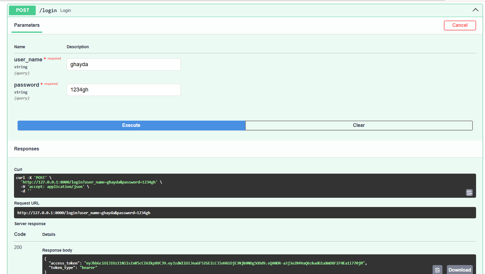
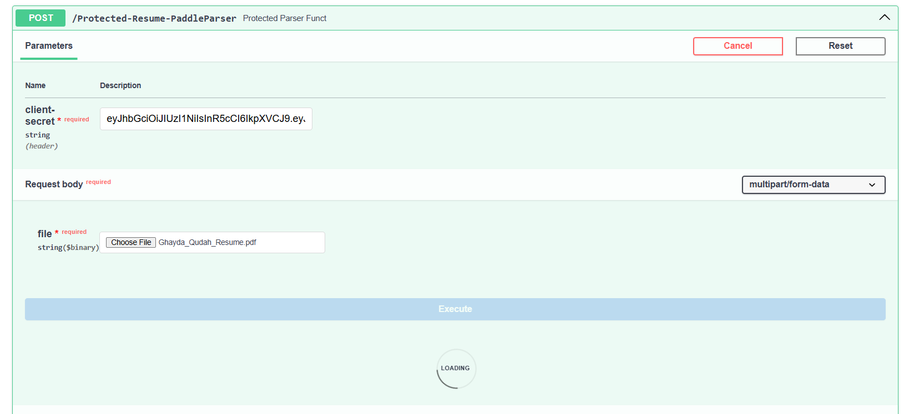
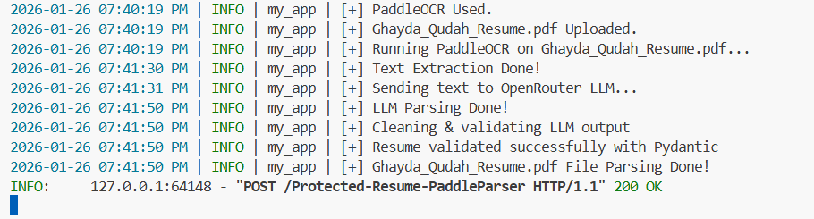
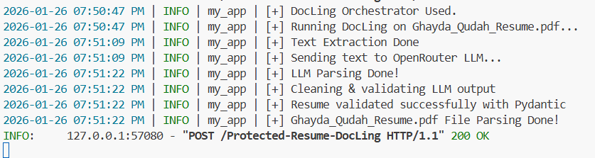
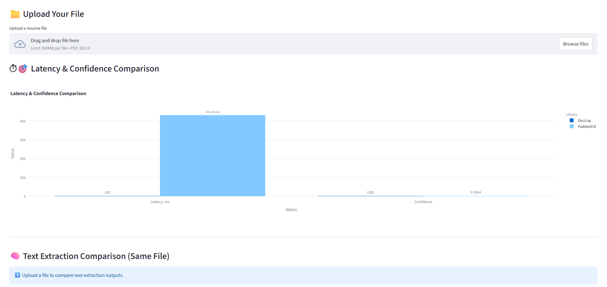
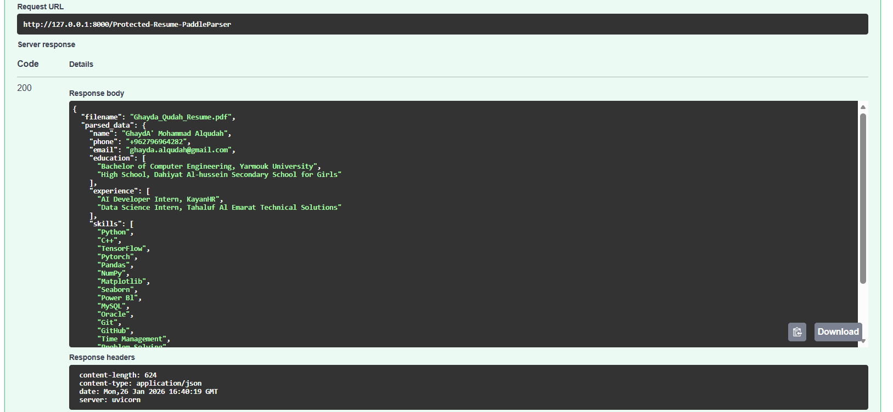
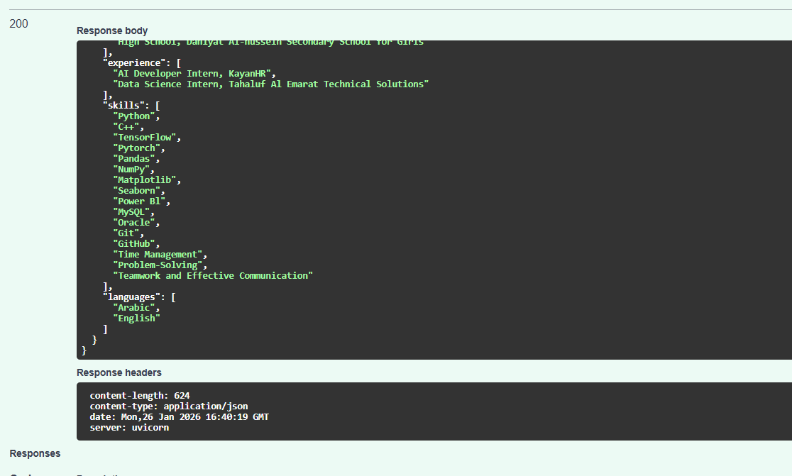
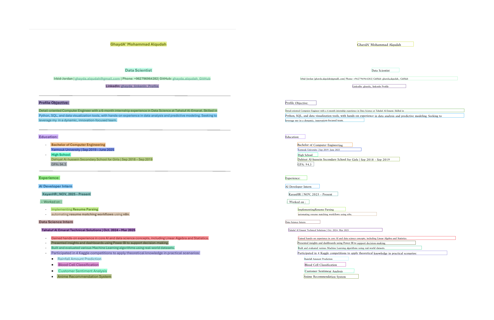
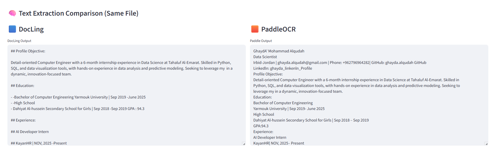

# Resumes_OCR_Parsing

📄 Resume Parsing System (OCR + LLM)

An end-to-end system for extracting structured information from resumes (PDF/images) using OCR and Large Language Models.

The system supports English and Arabic resumes and is designed as a modular, extensible pipeline suitable for AI-driven document processing workflows.


## 🚀 Features

OCR-based text extraction from PDF and image files

Resume parsing using LLMs

Structured JSON output

Visualized OCR detection & recognition results


## 🧠 System Architecture

```text
Input File (PDF / Image)
        ↓
OCR Engine (PaddleOCR / DocLing)
        ↓
Raw Extracted Text
        ↓
LLM Parsing (OpenRouter - LLaMA 3.3)
        ↓
Structured Resume JSON
```


## 🛠️ Technologies Used

Python

PaddleOCR — OCR engine for English and Arabic text

DocLing - EasyOCR backend

OpenRouter API — LLM-based text parsing

Pydantic — Data validation & schema enforcement

Streamlit — UI layer

Logging — Debugging & observability

FastAPI

ngrok


## ⚙️ Installation

```
pip install -r requirements.txt
```

Make sure you have:

Python 3.12

PaddleOCR dependencies installed correctly


## ▶️ Running the Project

```
uvicorn api.main:app --reload
```














```
streamlit run streamlit_app.py
```




📤 Input

PDF resumes

Image-based resumes (PNG, JPG)

Docs - use DocLing Orchestrator

Example:

file_path = "Ghayda_Resume.pdf"


📥 Output
1️⃣ Extracted Text

Raw text extracted via OCR.

2️⃣ Structured JSON

Example output:





3️⃣ OCR Visualization

Bounding boxes

Recognized text

Saved as images & JSON files







📌 Why Pydantic?

Pydantic is used to:

Enforce a strict schema for parsed resume data

Validate LLM outputs

Prevent malformed or incomplete JSON

Make the system safer for downstream services (APIs, DBs)


## ⚠️ Business Limitations

Scanned or low-resolution resumes may produce noisy text.

LLM responses are probabilistic and may hallucinate or miss fields.

Processing introduces latency (OCR + LLM).

Not suitable for real-time, high-volume production without scaling.

Human verification is recommended for hiring decisions.


## 🔐 Security & Privacy Notes

Resume data is processed temporarily.

Avoid storing sensitive personal data long-term.

API keys must be stored securely.


## 🔮 Future Improvements

Fine-tuned domain-specific LLM


## 👩‍💻 Author

Built with ❤️ by GhaydA'


